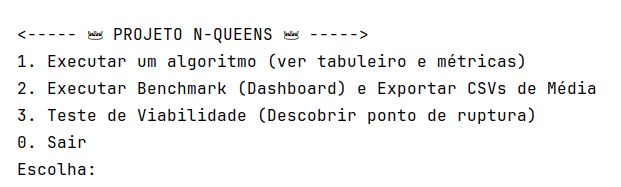
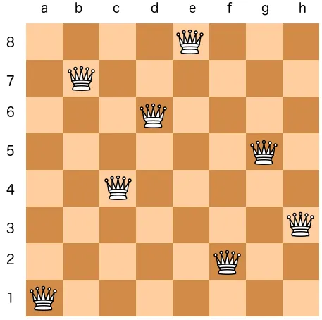

# 👑 N-Queens 👑

Repositório dedicado ao estudo comparativo e análise experimental de algoritmos para o clássico Problema das N-Queens, desenvolvido como projeto prático da disciplina de Técnicas de Análise de Algoritmos (TAAL) no período 2026.1.

---


## Como Rodar

### Pré Requisitos

- Java JDK 17 (LTS) ou superior
- IDE compatível (ex.: IntelliJ IDEA, Eclipse ou VS Code) ou uso do javac/java via terminal.
- Sistema operacional com suporte a Java (Windows, Linux ou macOS).


### Passo a passo:

1. **Clone o repositório:**
   ```bash
   git clone https://github.com/gabiandradeal/n-quenns-analysis.git
    ```
   
2. **Navegue até o diretório do projeto:**

    ```bash
   cd n-queens-analysis
    ```

2. **Compile e execute em um único comando Maven:**
Na raiz do projeto (onde está o arquivo `pom.xml`), rode o comando abaixo:
    ```bash
    mvn clean compile exec:java -Dexec.mainClass="com.nqueens.Main"
    ```


*(Nota: Caso utilize uma IDE como IntelliJ ou Eclipse, basta abrir a pasta do projeto, aguardar a sincronização do Maven e executar a classe `Main.java`).*

---


## O Menu Interativo

Ao iniciar o programa, você terá acesso a um terminal interativo com 3 ferramentas principais desenvolvidas para a análise:



* **Opção 1: Executar um algoritmo (Ver Tabuleiro e Métricas)**
  Permite escolher um tamanho de tabuleiro ($N$) e um dos algoritmos. O programa retorna instantaneamente o tempo de execução, memória gasta, podas realizadas e desenha a primeira solução encontrada no terminal utilizando emojis (exceto para o Bitmask, que não salva o histórico visual).
* **Opção 2: Executar Benchmark (Gerar CSVs)**
  Ferramenta de coleta de dados em lote. O usuário define o tamanho máximo de $N$ e o número de rodadas. O sistema testa todos os algoritmos para todos os $N$ repetidas vezes e exporta planilhas prontas com as médias na pasta `resultados_csv/`.
* **Opção 3: Teste de Viabilidade de entrada**
  Descobre empiricamente o limite do algoritmo. Você define um tempo limite de tolerância (ex: 1 minuto) e o programa começa a rodar N progressivamente ($4, 5, 6...$). Quando o tempo de resolução de um $N$ ultrapassar o limite, ele quebra o laço e emite um relatório provando em qual tamanho de entrada o algoritmo tornou-se inviável.


### Sobre emojis no terminal

Se os emojis não funcionarem quando você clicar em Run Main.java, provavelmente é porque sua IDE não reconheceu o terminal padrão como PowerShell na versão UTF-8.

**O que fazer?**
1. Assim que clicar em run, vai abrir um terminal. Se, ao lado do título "PROJETO N QUEENS", você ver que no lugar que deveria ser um emoji está o símbolo "?", escolha a opção 0 (sair).
2. Ainda nesse MESMO terminal, execute o seguinte comando: `[Console]::OutputEncoding = [System.Text.Encoding]::UTF8`
3. Depois, ainda com o mesmo terminal aberto, clique no botão para rodar (run) novamente.


---
## Estrutura do Projeto


```text
n-queens-analysis
├── 📂 .vscode/                 # Configurações de ambiente para emojis (UTF-8)
├── 📂 assets/                  # Imagens utilizadas no README
│   
├── 📂 resultados_csv/          # Diretório de saída dos benchmarks
│   ├── 📂 maquina1/            
│   ├── 📂 maquina2/  
│   ├── 📂 maquina3/          
│   └── 📂 maquina4/          
│  
├── 📂 src/main/java/com/nqueens/
│   ├── 📂 algorithms/          # Algoritmos Implementados
│   │   ├── ☕ Backtracking.java
│   │   ├── ☕ Bitmask.java
│   │   └── ☕ BranchAndBound.java
│   ├── 📂 benchmark/           # Automatização de testes em lote
│   │   ├── ☕ BenchmarkRunner.java
│   │   └── ☕ CsvExporter.java
│   ├── 📂 core/                # Modelos de dados e contratos
│   │   ├── ☕ Metrics.java
│   │   └── ☕ NQueensAlgorithm.java
│   ├── 📂 ui/                  # Renderização em emojis no terminal
│   │   └── ☕ Board.java
│   └── ☕ Main.java              
│
├── 📄 .gitignore               
├── 📄 pom.xml                   
└── 📄 README.md                

```

---
## O Problema

Posicionar N rainhas em um tabuleiro N×N de forma que nenhuma rainha ataque outra (mesma linha, coluna ou diagonal).



---
## Proposta do Estudo

Comparar experimentalmente diferentes estratégias de busca e poda aplicadas ao N-Queens, observando como cada uma lida com o crescimento exponencial do espaço de busca conforme N aumenta.

Abordagens definidas

- **Backtracking** clássico
- **Branch and Bound** (poda com tabelas de controle)
- **Bitmask** (representação das restrições via operações bit a bit)


---

## O que foi medido

- Tempo de execução e consumo de memória
- Estados explorados, chamadas recursivas, podas realizadas e soluções possíveis
- Ponto em que cada abordagem deixa de ser viável conforme N cresce

---

## Resultados e Metodologia

Os dados brutos coletados pela nossa equipe encontram-se exportados na pasta `resultados_csv/`.

Para garantir a validade estatística e isolar variações do sistema operacional e do *Garbage Collector* da JVM, a metodologia consistiu em:

* Executar **50 rodadas de testes** para cada algoritmo.
* O tamanho do tabuleiro variou do **N = 4 ao N = 14** (limite viável em tempo hábil para o Backtracking Clássico).
* Os dados das planilhas representam a **média aritmética** dessas 50 execuções.

A **discussão completa**, análise de complexidade, provas de corretude e os gráficos comparativos de desempenho detalhados encontram-se no documento `Relatório_TAAL.pdf`.


### Ambiente de Testes (Hardware)

Para avaliar o comportamento da explosão combinatória em diferentes cenários, os benchmarks foram executados nos seguintes setups computacionais:

|  | Máquina 1 | Máquina 2 | Máquina 3 | Máquina 4 |
| --- | --- | --- | --- | --- |
| **RAM** | 8GB | 20GB | 8GB | 16GB |
| **Processador** | Core I5-8265U | Core I5-1235U | Core I7-1255U | Core I5-1335U |
| **OS** | Windows 11 | Linux Debian 13 KDE | Windows 11 | Windows 11 |
| **ROM** | 238GB SSD | 512GB SSD | 512GB SSD | 512GB SSD |

---

## Entregáveis

- Código-fonte (Java/Maven)
- Geração e registro de lotes de teste comparando as três abordagens (tempo, memória, etc.)
- Relatório técnico (PDF)

---


## Autores


<table>
  <tr>
    <td align="center">
      <a href="https://github.com/gabiandradeal">
        <br />
        <sub><b>Gabriela Andrade</b></sub>
      </a><br />
    </td>
    <td align="center">
      <a href="https://github.com/georiSamuel">
        <br />
        <sub><b>Georis Samuel</b></sub>
      </a><br />
    </td>
    <td align="center">
      <a href="https://github.com/Horlanlacerda">
        <br />
        <sub><b>Horlan Lacerda</b></sub>
      </a><br />
    </td>
    <td align="center">
      <a href="https://github.com/SuelleMaciel">
        <br />
        <sub><b>Suelle Maciel</b></sub>
      </a><br />
    </td>
  </tr>
</table>

